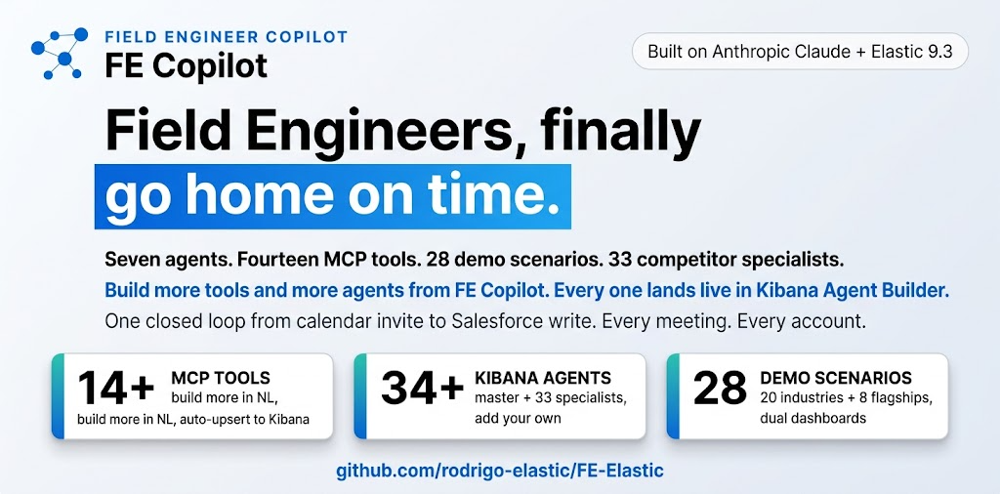

<p align="center"><strong>FY27 Sales Kickoff</strong> | May 11 to 14, 2026 . Las Vegas, Nevada</p>

<p align="center">
  
</p>

<p align="center"><em>Field Engineer Copilot. Fourteen MCP tools. 28 demo scenarios. Six hours per FE per week back.</em></p>

<p align="center">
  <a href="https://github.com/rodrigo-elastic/FE-Elastic/actions/workflows/ci.yml"></a>
  <a href="LICENSE"></a>
  <a href="https://www.python.org/downloads/"></a>
  <a href="https://www.elastic.co/"></a>
  <a href="https://www.anthropic.com/"></a>
</p>

# FE Copilot

Field Engineers run six customer meetings a day and burn fifteen hours a week on prep, deal-qualification capture, Salesforce updates, and the swivel-chair between Splunk, Datadog, Slack, and Salesforce. FE Copilot collapses that loop into seven agent surfaces and a tools rail that live inside Elastic. The pre-meeting researcher pulls live SEC EDGAR data and ships a PDF brief to Slack one hour before the call; the live companion whispers competitor and MEDDPICC alerts on every transcript turn; the post-meeting action engine fires six Salesforce writes plus a follow-up email draft on one click; QBR, TAR, weekly-status, and SA-to-CA handover generators turn the same meeting timeline into AE-ready and CA-ready artifacts.

Every tool is wired into Elastic Cloud 9.3.4 Agent Builder over MCP, so the master agent `fec_field_assistant` chains them inside Kibana. Customer data is routed through Kibana inference connectors with a strict no-fallback guard, never the direct Anthropic API. All data is synthetic. All agents fall back to Haiku 4.5 mock mode so a teammate can clone and run without any API key.

> **Demo data**: all customer names, employees, and financial figures shown in scenarios and brief outputs are fictional. Splunk and Datadog list pricing is from public sources. No real customer data is used.

**Production:** [https://fe-c85291a2a8b144188ee6be1078e79a95.ecs.us-east-1.on.aws](https://fe-c85291a2a8b144188ee6be1078e79a95.ecs.us-east-1.on.aws)

## Quickstart - get your own copy running in 5 steps

Every FE can spin up their personal copy in under 10 minutes. The first three steps are mandatory; the last two unlock the Kibana-side integrations (specialist agents, email handover, Slack notifications).

### Step 1. Clone, venv, install

```bash
git clone <repo-url> fe-copilot && cd fe-copilot
python3 -m venv .venv && source .venv/bin/activate
pip install -r backend/requirements.txt
```

macOS arm64 only, if you want PDF briefs: `brew install pango cairo libffi gdk-pixbuf`. Otherwise FE Copilot falls back to HTML briefs automatically.

### Step 2. Fill `.env` with your keys

```bash
cp .env.example .env
```

Then open `.env` and set the four keys that matter. Everything else has a working default. Mock mode kicks in if you leave them blank.

| Key | Where to get it | What it unlocks |
|---|---|---|
| `ANTHROPIC_API_KEY` | https://console.anthropic.com/settings/keys | Every Claude-backed tool and agent. Start here. |
| `ELASTICSEARCH_URL` + `ELASTICSEARCH_API_KEY` | Elastic Cloud console: deployment -> Manage -> API keys (give it `read,write,view_index_metadata` on `fec-*`) | Brief + post-meeting + audit log persistence, AutoOps webhook ingest, FE Brain corpus. |
| `KIBANA_URL` + `KIBANA_API_KEY` | Same deployment, Kibana -> Stack Management -> API keys ([privileges](docs/operations.md#kibana-api-key-privileges)). | Agent Builder integration, per-competitor specialist agents, custom tool CRUD, dashboards, email connector for handovers. |
| `SLACK_WEBHOOK_URL` *(optional)* | https://api.slack.com/messaging/webhooks - create a Slack app, add an Incoming Webhook for `#fe-copilot` | Brief + post-meeting + handover notifications get posted to Slack. Leave blank to skip; the app writes to `runtime/slack/*.json` instead. |

### Step 3. Seed local data + run

```bash
PYTHONPATH=backend python -m scripts.generate_synthetic_data
PYTHONPATH=backend uvicorn app.main:app --reload --port 8123
```

Open http://localhost:8123. The dashboard, Quick Research, Workspace, FE Brain, Customer Health, and Industries pages already work end-to-end against the Anthropic key alone. Skip the next two steps if you only need that.

### Step 4. Wire Kibana connectors (one-time)

Open Kibana -> Stack Management -> Connectors and create:

1. **Email connector** named `elastic-cloud-email` (the Elastic Cloud built-in is auto-present on Cloud; no SMTP required). Handover, follow-ups, and workflow rule notifications route through it.
2. **Anthropic inference connectors** named `Anthropic-Claude-Haiku-4-5` and `Anthropic-Claude-Opus-4-7` so every agent call is visible in Kibana usage metrics. Set the apiKey to the same Anthropic key from Step 2.

### Step 5. Provision the agents + tools in Kibana

```bash
PYTHONPATH=backend python -m scripts.sync_agent_builder         # master agent + 14 MCP tools
PYTHONPATH=backend python -m scripts.sync_battlecard_agents     # 33 per-competitor specialists (optional)
```

Both scripts are idempotent. Re-run any time you change a tool spec or add a new battlecard.

### Verify

```bash
curl -s http://127.0.0.1:8123/api/v1/health | jq .
PYTHONPATH=backend pytest backend/tests -q                       # 30 passed
```

## What is in the box

- **Seven agent surfaces** (pre-meeting, live companion, post-meeting, QBR, TAR, weekly slides, SA-to-CA handover) and a fourteen-tool MCP rail.
- **20 industries x 2 dashboards each** (FE-facing story + Customer-facing operations), plus 8 hand-built flagship scenarios. FE dashboards are a strict superset of the customer view with per-chart "use this in the call" callouts. Seed any one from `/industries.html`.
- **Per-competitor specialist agents** in Kibana Agent Builder, one per battlecard (33 today), reachable as inline chat on `/battlecards.html`.
- **Customer Health dashboard** that aggregates AutoOps cluster signals, renewal proximity, ticket trend, 90-day adoption sparkline, and rule-based proactive tasks per account.
- **Industries and Demo Data** combined catalog with simplified cards and a detail modal that links every competitor chip to its battlecard in a new tab.
- **Account handover** with real email delivery via the Kibana built-in `.email` connector (no SMTP setup needed on Cloud), with dual delivery (recipient + sender confirmation copy) and an inline preview panel.

Full page-by-page tour: [`docs/feature_tour.md`](docs/feature_tour.md).

## Deeper reading

The README stays short on purpose. Everything else is one click away:

- [`docs/why_we_win.md`](docs/why_we_win.md) - the judging-criteria pitch (FE impact, Agent Builder, Workflows, AutoOps, polish, reusability, demo quality).
- [`docs/how_it_works.md`](docs/how_it_works.md) - the system diagram and tech stack flow.
- [`docs/architecture.md`](docs/architecture.md) - component map and three hero data flows.
- [`docs/feature_tour.md`](docs/feature_tour.md) - every page, what it does, screenshot links.
- [`docs/personas.md`](docs/personas.md) - the full expert-role roster (14 role-grounded prompts, searchable by expertise keyword; no first-person names).
- [`docs/built_with.md`](docs/built_with.md) - tech stack and runtime targets.
- [`docs/project_layout.md`](docs/project_layout.md) - directory tree.
- [`docs/roadmap.md`](docs/roadmap.md) - near, medium, and long-term roadmap plus the complementary-tools story (Seismic, Highspot, Salesforce, Gainsight).
- [`docs/deploy.md`](docs/deploy.md) - seven-step AWS ECS deploy playbook.
- [`docs/operations.md`](docs/operations.md) - Kibana API-key privileges, supervisor loop, audit dashboard, CI, i18n, theme, a11y notes.
- [`docs/battlecard_skills_template.md`](docs/battlecard_skills_template.md) - canonical SKILL.md shape for the per-competitor specialists.
- [`docs/talk-tracks.md`](docs/talk-tracks.md) - per-role talk tracks the FE community can drop straight into a customer conversation.

## About

Built by [Rodrigo Careaga](https://www.linkedin.com/in/rodrigocareaga/) (Senior Customer Architect, Elastic) for the FY27 SKO FE Summit Hackathon. The tool I wished I had every Monday morning.

License: [MIT](LICENSE).
