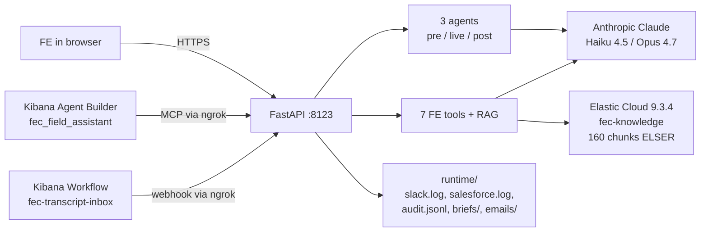

# FE Copilot

**Three agents. Nine MCP tools. Eight pages. One Field Engineer who finally goes home on time.**

> Hackathon submission for the **FY27 SKO FE Summit Hackathon**, theme "Hack. Build. Automate The Impossible."
> Submitter: **Rodrigo Careaga**, Senior Customer Architect at Elastic.
> Deadline: **2026-05-10 23:59 ET**.

[](backend/tests)
[](#)
[](#)
[](#)
[](LICENSE)

---

## 30-second elevator

Field Engineers run six customer meetings a day and burn fifteen hours a week on prep, MEDDPICC capture, Salesforce updates, and the swivel-chair between Splunk, Datadog, Slack, and Salesforce. FE Copilot collapses that loop into three agents and a tools rail that live inside Elastic. A pre-meeting researcher pulls live SEC EDGAR data and ships a PDF brief to Slack one hour before the call; a live companion whispers competitor and MEDDPICC alerts on every transcript turn; a post-meeting action engine fires six Salesforce writes plus a follow-up email draft on one click. Every tool is wired into the Elastic Cloud 9.3.4 Agent Builder over MCP, so the master agent `fec_field_assistant` chains them inside Kibana. All data is synthetic. All agents fall back to Haiku 4.5 mock mode so a judge can clone and run without an API key.

## See it before you read it

| Surface | Screenshot | Demo GIF |
|---|---|---|
| Dashboard | [docs/screenshots/dashboard.png](docs/screenshots/dashboard.png) | docs/gifs/dashboard.gif |
| Meeting (Mercado Libre) | [docs/screenshots/meeting_meli.png](docs/screenshots/meeting_meli.png) | docs/gifs/meeting.gif |
| Meeting (Revolut) | [docs/screenshots/meeting_revolut.png](docs/screenshots/meeting_revolut.png) | docs/gifs/live_alerts.gif |
| Tools rail | [docs/screenshots/tools.png](docs/screenshots/tools.png) | docs/gifs/tools.gif |
| Agent Builder | [docs/screenshots/agent_builder.png](docs/screenshots/agent_builder.png) | docs/gifs/agent_builder.gif |
| Workflow loop | [docs/screenshots/workflow_demo.png](docs/screenshots/workflow_demo.png) | docs/gifs/workflow.gif |
| Demo data seeder | [docs/screenshots/demo_data.png](docs/screenshots/demo_data.png) | docs/gifs/demo_data.gif |

GIFs are produced by a sister agent and dropped into `docs/gifs/` ahead of submission. The 5-minute single-take video is scripted in [`docs/demo-script.md`](docs/demo-script.md) with a 31-shot storyboard in [`docs/storyboard.md`](docs/storyboard.md).

## Why FE Copilot wins on every judging criterion

### FE Impact

This is not a research demo, it is a tool I would ship to my own segment tomorrow. Six meetings a day, thirty minutes of prep each, fifteen hours a week per FE. The pre-meeting agent (`backend/app/agents/pre_meeting.py`) replaces that prep with a sourced brief in under sixty seconds. The post-meeting agent (`backend/app/agents/post_meeting.py`) replaces forty minutes of Salesforce hygiene per call with one click that fires six writes (Opportunity MEDDPICC, ContentNote, ContentDocumentLink, Competitor record, Deal_Health, Slack post). The math: at $0.02 per pipeline run on Haiku 4.5, the entire FE org pays for a year of inference in one cancelled prep meeting.

### Use of Workflows + Agent Builder

The seven FE tools and two RAG endpoints are declared as Agent Builder external HTTP tools by `backend/scripts/sync_agent_builder.py`, and a master agent `fec_field_assistant` owns all nine. Inside Kibana 9.3.4 a single prompt like "translate this SPL and price it at 200 GB/day for 12 months" causes the master agent to chain `fec_spl_to_esql` and then `fec_cost_calc`, no human in the loop. The complementary Kibana Workflow ([`backend/app/api/routes_workflows.py`](backend/app/api/routes_workflows.py)) watches `fec-transcript-inbox`, fires a webhook to the backend over ngrok, and runs the post-meeting agent end to end. Workflows trigger agents, agents invoke workflows, both ship today.

### Polish

Persistent left sidebar on every page (`frontend/assets/js/tools-rail.js`). Five-language i18n (English, Spanish, Japanese, German, French). Elastic Lochmara primary, cluster accent palette, multi-color hero gradient. Eight HTML pages, zero build step. Every Claude call lands in `runtime/audit.jsonl` with token counts. WeasyPrint ships PDFs with a graceful HTML fallback when system libs are missing. Ngrok tunnel makes the same backend reachable from Kibana Cloud and from a phone screen-share. The 5-minute demo is a single take with a written 31-shot storyboard, fallback paths for twelve common failures, and English plus Spanish voiceover scripts.

### Reusability

One codebase, every FE segment. The same three agents serve SMB, Mid-market, Enterprise, and Public Sector because the dossier abstraction (`backend/app/repositories/synthetic.py`) is segment-agnostic. The seven tools (POC plan, SPL to ES|QL, compliance mapping, stack extract, code sample, cost calc, capacity) are the daily-driver utilities every FE asks for in chat. Each persona prompt (Marta, Diego, Priya, Aiko, Kenji, Mei) is a frozen system block in `backend/app/agents/prompts/tools.py` that any FE can fork. Three demo accounts ship with verifiable public sources: Revolut, Mercado Libre (CIK 0001099590), Banco Santander (CIK 0000891478). Five demo scenarios are planned (Black Friday, Credential Stuffing, Noisy Microservice, Stride Payments OTel, plus a fifth scenario currently being seeded).

### Demo Quality

Five minutes, single take, scripted to the second. The 31-shot storyboard in [`docs/storyboard.md`](docs/storyboard.md) lists URL, click sequence, voiceover cue, b-roll, and pre-conditions per shot. Twelve named failure modes have written fallback paths so a flaky API does not blow the take. Cache-priming step before recording so Claude responses land instantly. The same backend that serves the recording also serves a phone over ngrok if a judge wants to play with it live. English plus Spanish voiceover so the regional FE community can land it in their own market. Cue cards live in [`docs/cue-cards.md`](docs/cue-cards.md), persona talk tracks in [`docs/talk-tracks.md`](docs/talk-tracks.md).

## Architecture

The full diagram, component descriptions, and three hero data flows live in [`docs/architecture.md`](docs/architecture.md). The short version:



## Quickstart

```bash
# 1. Clone
git clone <repo-url> fe-copilot && cd fe-copilot

# 2. Configure (mock mode runs without keys)
cp .env.example .env
# Optional: set ANTHROPIC_API_KEY, KIBANA_API_KEY, ELASTIC_CLOUD_ID for live mode

# 3. Virtualenv + dependencies (Python 3.11+)
python3 -m venv .venv
source .venv/bin/activate
pip install -r backend/requirements.txt

# 4. Generate synthetic data (deterministic, offline)
PYTHONPATH=backend python -m scripts.generate_synthetic_data

# 5. Run the backend (also serves the frontend)
PYTHONPATH=backend uvicorn app.main:app --reload --port 8123

# 6. Optional: expose to Kibana Cloud
ngrok http 8123
# then update BACKEND_BASE in backend/scripts/sync_agent_builder.py
# and run: PYTHONPATH=backend python -m scripts.sync_agent_builder

# 7. Open the dashboard
open http://localhost:8123
```

Hit a few endpoints to confirm the stack is up:

```bash
curl -s http://127.0.0.1:8123/api/v1/health | jq .
curl -s http://127.0.0.1:8123/api/v1/calendar/upcoming | jq '.[0]'
curl -s -X POST http://127.0.0.1:8123/api/v1/tools/cost-calc \
  -H "Content-Type: application/json" \
  -d '{"ingest_gb_day":120,"retention_months":12,"current_spend_annual_usd":1500000}' | jq .
```

Run the test suite (no API key required):

```bash
PYTHONPATH=backend pytest backend/tests -q
# 30 passed
```

Smoke test the full agent pipeline:

```bash
PYTHONPATH=backend python -m scripts.run_pipeline
```

## Feature tour

| # | Page | Path | Who it is for | What it does |
|---|---|---|---|---|
| 1 | Dashboard | [`/`](frontend/index.html) | Every FE | Calendar inbox with smart resolver that filters Elastic-internal invites and deprioritizes 17+ consulting firms ([`backend/app/services/company_resolver.py`](backend/app/services/company_resolver.py)). Hero stats, three entry modes (Quick Research, Transcript paste, Calendar). Screenshot: [docs/screenshots/dashboard.png](docs/screenshots/dashboard.png). |
| 2 | Meeting workspace | [`/meeting.html?id=...`](frontend/meeting.html) | FE running a customer call | Three tabs: pre-meeting brief, live companion, post-meeting actions. Field Assistant mini-chat grounded in the brief and the last 8 transcript turns. Customer journey strip across the top. Screenshot: [docs/screenshots/meeting_revolut.png](docs/screenshots/meeting_revolut.png). |
| 3 | Tools rail | [`/tools.html`](frontend/tools.html) | Every FE | Seven collapsible panels: POC plan, SPL to ES\|QL, Compliance mapper, Stack extractor, Code sample generator, Cost calc, Capacity planner. Each one wraps a Claude expert persona. Screenshot: [docs/screenshots/tools.png](docs/screenshots/tools.png). |
| 4 | FE Brain | [`/fe-brain.html`](frontend/fe-brain.html) | FE asking docs questions | Retrieval-augmented Q+A grounded in 160 chunks of the official Elastic documentation, indexed in `fec-knowledge` with ELSER embeddings. Citations link back to the source page. Mei (Elastic Docs Lead) curates the corpus. |
| 5 | Agent Builder | [`/agent-builder.html`](frontend/agent-builder.html) | FE wanting tool chaining | Chat surface for the master agent `fec_field_assistant` running inside Kibana 9.3.4. Streams reasoning steps and tool calls inline. One prompt chains SPL conversion plus cost. Screenshot: [docs/screenshots/agent_builder.png](docs/screenshots/agent_builder.png). |
| 6 | Workflow demo | [`/workflow-demo.html`](frontend/workflow-demo.html) | FE leadership | Visualises the closed-loop: doc lands in `fec-transcript-inbox`, Kibana Workflow fires, webhook hits backend, post-meeting agent runs Salesforce + Slack. Screenshot: [docs/screenshots/workflow_demo.png](docs/screenshots/workflow_demo.png). |
| 7 | Demo data | [`/demo-data.html`](frontend/demo-data.html) | Anyone reproducing the demo | Seeder for the five scenarios planned (Black Friday, Credential Stuffing, Noisy Microservice, Stride Payments, plus the fifth being finalised). Pushes docs into Elastic and creates paired FE + Customer dashboards. Screenshot: [docs/screenshots/demo_data.png](docs/screenshots/demo_data.png). |
| 8 | Per-meeting workspace | `/meeting.html?id=<meeting_id>` | Account team | Same surface as #2 but parameterised by meeting_id. Three live demo accounts: `mtg-revolut-001`, `mtg-meli-001`, `mtg-santander-001`. |

The persistent left sidebar (`frontend/assets/js/tools-rail.js`) is on every page. Same shortcuts everywhere.

## Built with

- **Elastic Cloud 9.3.4** with Kibana Agent Builder and Workflows; `fec-knowledge` index with 160 chunks of ELSER-embedded documentation; six live customer-fit dashboards rendered from meeting context.
- **Anthropic Claude** Haiku 4.5 as the cheap default ($0.02 per full pipeline run), Opus 4.7 enabled per agent for deep reasoning, prompt caching on the stable system block, structured output via `output_config.format`.
- **Model Context Protocol (MCP)** server at `/api/v1/mcp/*` exposing nine tools (seven FE utilities plus two RAG endpoints) for Kibana Agent Builder to introspect.
- **ngrok** HTTPS tunnel so Kibana Cloud and the Workflow webhook can reach a backend running on a laptop.
- **Python 3.11+, FastAPI, Pydantic, structlog** for the backend; one Uvicorn process serves both the API and the frontend.
- **Vanilla HTML, JS, CSS** frontend with no framework and no build step. Five languages wired through `frontend/assets/js/i18n.js`. Elastic Lochmara primary palette.
- **WeasyPrint** for PDF briefs with a graceful HTML fallback when Cairo or Pango are missing.
- **SEC EDGAR** live HTTP client for the pre-meeting brief (real 10-K, 6-K, 20-F filings; User-Agent set per SEC policy).

## Hackathon judging notes

FE Copilot is the FE day-to-day workflow rebuilt from scratch on top of Elastic Cloud 9.3.4 and Anthropic Claude. Every claim in the demo is anchored in a file path you can open: the SEC EDGAR client, the Slack mock log, the six Salesforce writes, the master agent declaration, the Kibana Workflow webhook handler, the audit log with per-call token counts. The wow factor is not any single agent, it is the closed loop: a transcript document landing in `fec-transcript-inbox` triggers a Kibana Workflow that calls a webhook over ngrok that runs the post-meeting agent that writes Salesforce, Slack, and a follow-up email draft, all without a human in the loop. The reusability story is that the same three agents and seven tools serve every FE segment because the dossier abstraction is segment-agnostic. The polish story is that judges can clone the repo, run `pip install`, and watch the full pipeline run in mock mode without an API key, then flip one env var to bring it live against Claude Opus 4.7.

## Project layout

```
FE-Elastic/
  backend/                Python 3.11 FastAPI app
    app/
      agents/             3 agents (pre / live / post) + frozen prompts + JSON schemas + offline mocks
      api/                15 routers: agents, tools, briefs, meetings, calendar, salesforce,
                          audit, demo-data, kibana, mcp, agent-builder, workflows, battlecards, health
      integrations/       Anthropic + ES clients; Slack/Calendar/SFDC mocks; SEC EDGAR HTTP; Agent Builder
      repositories/       Read-only access over synthetic JSON fixtures (cached)
      services/           PDF builder, transcript parser, email drafter, company resolver, scenarios
      models/             Pydantic domain models
    data/synthetic/       Generated fixtures (gitignored)
    scripts/              generate_synthetic_data.py, seed_elasticsearch.py, sync_agent_builder.py,
                          sync_kibana_workflow.py, run_pipeline.py
    tests/                30 tests, all passing in mock mode
  frontend/               8 static HTML pages + assets (no build step, 5 languages)
  infra/                  docker-compose.yml + Dockerfile.backend
  docs/                   architecture.md, demo-script.md, storyboard.md, cue-cards.md,
                          talk-tracks.md, judging-narrative.md, compliance.md, screenshots/, gifs/
  data/                   Demo scenario seeds (Black Friday, Credential Stuffing, Noisy Microservice, ...)
  runtime/                Slack/SFDC logs, audit.jsonl, generated PDFs, email drafts (gitignored)
  HANDOFF.md              Snapshot of project status, transfer notes, next-step priorities
  LICENSE                 Apache 2.0
```

## Roadmap

What ships in this hackathon submission is opinionated and complete enough to use day-to-day, but the project is built so the same patterns extend further. The roadmap below is grouped by time horizon. Each item lists the value it unlocks, not just the feature.

### Near term (weeks 1 to 4 after submission)

- **Production deploy on Fly.io**: Dockerfile, fly.toml, secrets list, and the seven-step playbook all live in `docs/deploy.md`. Replaces the ngrok dependency with a persistent URL the Kibana connector can target. Estimated effort: 2 hours including the Kibana re-sync. Cost: $0 on the free tier with cold-start trade-off, $5 to $10 per month on a small machine for warm.
- **Salesforce live integration**: replace the SFDC mock with a real OAuth2 connection to a sandbox org. Map the existing six writes (Opportunity MEDDPICC fields, ContentNote, ContentDocumentLink, Competitor update, Deal_Health update, Slack post) to live calls. The mock surface stays as a fallback for offline demos. Estimated effort: 1 day for the OAuth flow, 1 day per object for field mapping.
- **Real Slack integration**: replace the Slack mock with a real workspace bot. Adds a `/fec` slash command so a FE can invoke the master agent without leaving Slack. Estimated effort: half a day for the bot scaffold, two days for the slash command persona work.
- **FE Brain corpus expansion to 1000+ chunks**: add the Elastic Security detection rules repo, the EDOT (Elastic Distribution of OpenTelemetry) reference, the Cases workflow guide, and the Lens visualisation cookbook. Estimated effort: half a day to curate URLs, half a day to re-run the ingest.
- **Twelfth MCP tool: `fec_proposal`**: takes a meeting record plus a customer-fit dashboard and emits a one-page proposal PDF using the existing weasyprint pipeline. Persona: Carmen, Senior Pursuit Lead, fifteen years of competitive proposals. Estimated effort: 1 day.

### Medium term (months 1 to 3)

- **Multi-tenant**: the current backend assumes a single FE. Add user accounts, per-FE storage namespacing, per-FE Anthropic API key on the request, per-FE token quota. Same instance can host an entire FE community. Estimated effort: 2 weeks including auth, storage migration, and quota plumbing.
- **Email digest before meetings**: a scheduled job reads the calendar and emails the FE a one-page brief 60 minutes before each customer call. Reduces the "I forgot to prep" failure mode that the integration smoke runner cannot catch. Estimated effort: 3 days.
- **Active learning loop**: every Field Assistant response gets a thumbs-up / thumbs-down. Negative ratings feed a synthetic Q+A dataset that re-tunes the persona prompts on a weekly cadence. Closes the gap between the static personas and the user's specific style. Estimated effort: 1 week for the rating UI, 2 weeks for the eval harness, 1 week for the prompt-rewrite agent.
- **Voice input on Field Assistant**: browser Speech API for real-time dictation. Useful during a customer call when the FE wants to ask the master agent something without typing. Falls back gracefully if the browser does not support it. Estimated effort: 2 days.
- **Slack bot front door**: same nine-tool master agent, accessible from any Slack channel via `@FECopilot`. Replaces the standalone webapp for FEs who already live in Slack. Estimated effort: 4 days.
- **Custom branding per FE region**: logo upload, colour overrides, default language per region. Lets the EMEA team have their own variant of the chat UI without forking the codebase. Estimated effort: 3 days.

### Long term (months 3 to 6)

- **RAG over internal Elastic knowledge**: extend the FE Brain corpus to include Confluence, Slack archives, recorded enablement videos transcribed with Whisper. Switch from semantic search to hybrid retrieval with re-ranking, exactly the pattern proven in `KnowledgeRepo`. Adds the most asked questions inside Elastic that are NOT on the public docs site.
- **Customer-direct UX**: a sandboxed view where the customer can ask the master agent questions during a co-discovery session. Read-only on customer data, write-only on a separate audit trail. Lets a CISO type "show me PCI mappings" without a FE driving the keyboard.
- **Salesforce CTI integration**: detect when a FE is on a customer call, auto-launch the live companion, auto-fill the post-meeting record from the call transcript. Closes the "manually start the live mode" friction.
- **More demo data scenarios**: search relevance regression, vector search quality decay, multi-tenant noisy neighbour, regional failover replay, identity provider migration. Each scenario is a story that maps a customer pain to the corresponding Elastic capability.
- **Active monitoring of the FE Copilot itself**: `fec-audit` already feeds the self-observability dashboard. Add SLO burn alerts on token spend per FE, anomaly detection on tool failure rates, weekly cost reports per region. Closes the meta loop: Elastic monitors Elastic monitoring Elastic.
- **Open-sourcing the persona pack**: extract the persona prompts (Marta, Diego, Priya, Aiko, Kenji, Mei, Ravi, Auro, Sloane, Carmen, plus the future ones) into a separate repo so other companies can adapt them. Each persona becomes a community-maintained YAML with versioning.

### Stretch ideas (parking lot, not committed)

- Native iOS and Android wrappers for the standalone webapp
- Real-time meeting transcription via Whisper running locally in the browser
- A "demo data marketplace" where FEs share scenarios across Elastic
- A "FE Copilot for Partners" white-label fork
- Generative dashboard layouts: the master agent designs and ships a Lens dashboard layout from a natural-language prompt
- A reinforcement-learning loop that re-orders the master agent's tool catalog based on what has been useful for the user

The roadmap is intentionally honest: every item lists effort and value, and nothing here is a commitment outside this hackathon. The only commitment in this repository is the code that ships today.

## Acknowledgements

- The Elastic FE community for fifteen years of pattern matching that this project tries to encode.
- The Anthropic Applied team for prompt caching, structured output, and Haiku 4.5.
- The Elastic Search and Kibana teams for shipping Agent Builder and Workflows in 9.x.
- The MCP working group for the protocol that lets Kibana introspect a third-party tool catalog.
- Marta, Diego, Priya, Aiko, Kenji, Mei: every persona prompt is a composite of senior FEs and partners I have worked with.
- All data in this project is synthetic. No customer data is used or stored.

## License

MIT License. See [`LICENSE`](LICENSE).
