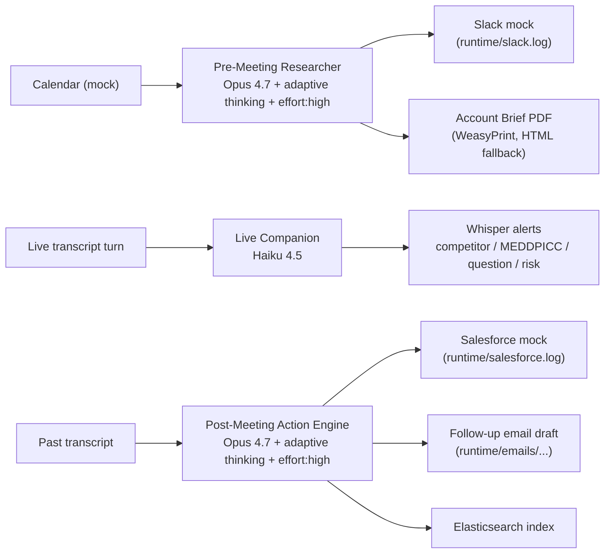

# FE Copilot Architecture

Three chained agents process Field Engineer meetings end to end.

## High-level flow



## Models (cheap by default, swappable per agent)

Default for every agent is `claude-haiku-4-5` (cheapest tier: $1 / $5 per 1M tokens). A full end-to-end pipeline run on Haiku costs roughly **$0.02 per meeting**. Set the env vars below to upgrade individual agents to Sonnet 4.6 or Opus 4.7 when intelligence matters more than cost.

```
# .env
MODEL_DEFAULT=claude-haiku-4-5      # cheapest; default for all agents
MODEL_PRE_MEETING=                  # leave blank to use MODEL_DEFAULT
MODEL_POST_MEETING=                 # e.g. claude-opus-4-7
MODEL_LIVE_MEETING=                 # e.g. claude-haiku-4-5
```

| Agent | Cheap default | When to upgrade | Why |
|---|---|---|---|
| Pre-Meeting Researcher | `claude-haiku-4-5` | `claude-opus-4-7` | Deeper synthesis across news + transcripts + tickets when budget allows. |
| Post-Meeting Action Engine | `claude-haiku-4-5` | `claude-opus-4-7` | Grounded extraction (verbatim quotes) and MEDDPICC tagging benefit from reasoning. |
| Live Companion | `claude-haiku-4-5` | (stay on Haiku) | Per-turn alerts must be sub-second; `effort` errors on Haiku 4.5, and adaptive thinking is unsupported anyway. |

The Anthropic SDK wrapper (`app.integrations.claude_client`) is model-aware: it omits `thinking` / `effort` automatically when the configured model is Haiku, so flipping a single env var flips the request shape without code changes.

## Reliability and offline mode

- `ClaudeService` enters mock mode automatically when `ANTHROPIC_API_KEY` is empty or the placeholder. Each prompt module ships hand-written mock payloads keyed by `company_id`, so the demo runs end-to-end without internet.
- Prompt caching uses `cache_control: {type: "ephemeral"}` on the stable system block. The volatile dossier (the per-meeting context) is rendered into the user message, which keeps the cache prefix intact across calls.
- WeasyPrint is best-effort: if Cairo/Pango are missing on the host, the PDF builder writes the rendered HTML instead and the rest of the demo continues.
- All mocked integrations (Slack, Salesforce, Calendar) write or read JSON files under `runtime/` so the demo has tangible artifacts to show.

## Components

- `backend/app/agents/`: `Agent` base class plus three concrete agents.
- `backend/app/agents/prompts/`: frozen system prompts plus JSON schemas plus offline mocks per agent.
- `backend/app/integrations/claude_client.py`: Anthropic SDK wrapper. Handles caching, structured output, mock mode, model-aware kwargs (no `effort` on Haiku, no `temperature` on Opus 4.7).
- `backend/app/repositories/synthetic.py`: read-only access over the synthetic JSON fixtures (cached).
- `backend/app/services/`: PDF builder (Jinja + WeasyPrint with HTML fallback), transcript helpers, email persistence.
- `backend/app/api/`: FastAPI routers (`/meetings`, `/agents`, `/briefs`, `/health`).
- `frontend/`: plain HTML + JS dashboard served by FastAPI; no framework, no build step.
- `infra/docker-compose.yml`: local Elasticsearch and Kibana.

## Quick Research (ad-hoc accounts)

`POST /api/v1/agents/pre-meeting/ad-hoc` accepts a tiny user-typed payload (`company_name` plus optional `industry`, `size`, `tech_stack`, `notes`, `meeting_title`) and runs the Pre-Meeting agent against a transient dossier built only from those fields. Nothing else leaves the boundary. The result is persisted under `runtime/briefs/ad-hoc-<slug>-<timestamp>.json` with both the company and meeting snapshots so the dashboard can read it back without a synthetic fixture.

This is the primary path for extrapolating the demo to a real customer name without seeding synthetic data first.

## Audit and compliance surface

Every Claude call goes through `ClaudeService.call_structured`, which appends a structured row to `runtime/audit.jsonl`:

```
{"ts":"2026-05-03T08:31:39+00:00","model":"claude-haiku-4-5","mode":"live",
 "input_tokens":2006,"output_tokens":1285,"cache_read_input_tokens":0,
 "cache_creation_input_tokens":0,"agent":"pre_meeting",
 "meeting_id":"acme-mtg-001","company_id":"acme-001"}
```

Exposed via `GET /api/v1/audit?limit=N`. The dashboard footer shows running totals. See `docs/compliance.md` for the full data-flow story.

## Synthetic data deterministic anchor

`scripts/generate_synthetic_data.py` anchors every timestamp to `NOW = 2026-05-02 09:00 UTC` and seeds `random` to `42` so output is byte-identical across runs. That keeps demos reproducible and tests stable.
