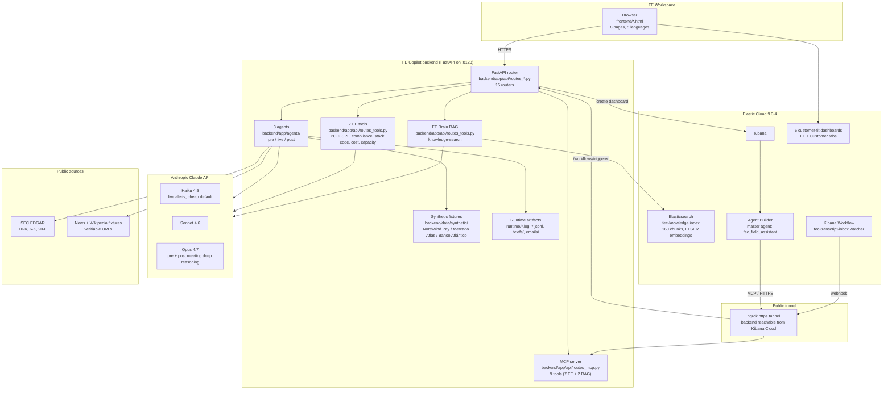

# FE Copilot Architecture

This page is the single source of truth for how FE Copilot is wired. Every box in the diagram below maps to a file path in this repo, and every arrow maps to an HTTP call, an SDK call, or a file write you can `tail` while the demo runs.

> The README links here. If you only have time for one diagram, this is the one.

## System diagram

## Component descriptions

**Browser frontend.** Eight static HTML pages served by FastAPI from `frontend/`: dashboard, meeting workspace, tools rail, FE Brain, Agent Builder chat, demo data, workflow demo, and a per-meeting view. No framework, no build step. The persistent left sidebar (`frontend/assets/js/tools-rail.js`) is injected into every page. Five languages are wired through `frontend/assets/js/i18n.js` (English, Spanish, Japanese, German, French).

**FastAPI backend.** Single Uvicorn process on port 8123 (`backend/app/main.py`). Fifteen routers under `backend/app/api/routes_*.py`: agents, tools, briefs, meetings, calendar, salesforce, audit, demo-data, kibana, mcp, agent-builder, workflows, battlecards, health, plus a static mount for `frontend/`. Pydantic models in `backend/app/models/` enforce schema at the boundary; structlog writes a JSON line per request.

**Three agents.** `backend/app/agents/pre_meeting.py`, `live_meeting.py`, `post_meeting.py`. Each agent inherits a base `Agent` class that calls `ClaudeService.call_structured` with a frozen system prompt, a JSON schema, and a per-meeting dossier. Mock mode (`ANTHROPIC_API_KEY` blank) returns hand-written payloads so the demo runs offline.

**Seven FE tools.** Expert-persona Claude wrappers exposed at `/api/v1/tools/{poc-plan, spl-to-esql, compliance-mapping, stack-extract, code-sample, cost-calc, capacity}`. Personas: Marta (POV architect), Diego (ex-Splunk), Priya (ex-PwC compliance), Aiko (Discovery analyst), Kenji (SDK cookbook author). All persona prompts live in `backend/app/agents/prompts/tools.py`.

**FE Brain RAG.** A retrieval-augmented Q+A surface over the official Elastic documentation. The `fec-knowledge` index in Elastic Cloud holds 160 chunks with ELSER sparse embeddings; `/api/v1/tools/knowledge-search` retrieves the top chunks and feeds them to Claude, with citations rendered in the UI.

**MCP server.** `backend/app/api/routes_mcp.py` exposes the seven tools plus the two RAG endpoints (search and ask) as Model Context Protocol tools at `/api/v1/mcp/*`. Nine tools total, declared with JSON schemas Kibana Agent Builder can introspect.

**Elastic Cloud 9.3.4.** A real Elasticsearch + Kibana deployment. Beyond the RAG index, Kibana hosts the master Agent Builder agent `fec_field_assistant`, six live customer-fit dashboards generated from meeting context, and a Workflow rule that watches `fec-transcript-inbox`.

**Agent Builder.** Kibana 9.x Agent Builder declares the nine MCP tools and one master agent; declaration script lives in `backend/scripts/sync_agent_builder.py`. The master agent reasons across tools, so a single prompt like "translate this SPL and price it at 200 GB/day" chains `fec_spl_to_esql` then `fec_cost_calc` automatically.

**Kibana Workflow.** A scheduled rule polls `fec-transcript-inbox` every minute. When a new transcript document lands, the rule fires a webhook to the FE Copilot backend at `/api/v1/workflows/triggered`. The post-meeting agent runs end to end with no human in the loop. Logged to `runtime/workflows.log`.

**ngrok tunnel.** Because Kibana Cloud cannot reach `localhost`, we expose the backend over an `ngrok https` tunnel. The tunnel URL is plumbed into both the Agent Builder tool registration and the Kibana Workflow webhook target.

**Anthropic Claude.** Three model tiers in use. Haiku 4.5 is the cheap default (one cent per pre-meeting brief, sub-second live alerts). Opus 4.7 is enabled per agent via `MODEL_PRE_MEETING` / `MODEL_POST_MEETING` for the deep reasoning beats. Prompt caching is on the stable system block (`backend/app/integrations/claude_client.py`).

**Runtime artifacts.** Every mocked integration writes a tangible file: `runtime/slack.log`, `runtime/salesforce.log`, `runtime/audit.jsonl`, `runtime/briefs/*.json`, `runtime/emails/*.html`, `runtime/workflows.log`. Tail any of them during the demo to prove the pipeline ran.

## Data flow: three hero scenarios

### Scenario 1: Pre-meeting brief (one hour before the call)

1. The dashboard `/` reads `/api/v1/calendar/upcoming` and surfaces the meeting card.
2. The FE clicks "Run Pre-Meeting". The browser POSTs to `/api/v1/agents/pre-meeting/{meeting_id}`.
3. `pre_meeting.py` builds a dossier from `backend/data/synthetic/` and pulls live data from SEC EDGAR (`backend/app/integrations/sec_edgar.py`) plus news fixtures with verifiable URLs.
4. `ClaudeService` calls Claude (Haiku by default, Opus 4.7 when budget allows) with a structured-output schema.
5. The brief is persisted as JSON under `runtime/briefs/`, rendered in the UI, posted to `#fe-copilot-briefs` via the Slack mock, and built into a PDF via WeasyPrint with HTML fallback.

### Scenario 2: Live alerts during the call

1. The meeting view at `/meeting.html?id=...` opens a transcript replay.
2. For each turn the browser POSTs to `/api/v1/agents/live/{meeting_id}/turn`.
3. `live_meeting.py` runs Haiku 4.5 once per turn against a tight prompt that asks for competitor mentions, MEDDPICC slot tags, unanswered questions, and risk flags. Per-turn cost: a fraction of a cent.
4. Alerts render inline under the turn that produced them. Each alert links back to the source quote so a human can verify what fired the alert.
5. The Field Assistant mini-chat under the transcript is plumbed to the same MCP server the Agent Builder uses, so chip questions ("what should I say next?") get the same grounded answers.

### Scenario 3: Post-meeting sync (one click after the call)

1. The FE clicks "Run Post-Meeting". The browser POSTs to `/api/v1/agents/post-meeting/{meeting_id}`.
2. `post_meeting.py` runs a longer Claude call (Opus 4.7 by default) producing a structured payload: summary, action items with verbatim quotes, MEDDPICC update, competitor mentions, follow-up email body.
3. The agent then writes six records via the Salesforce mock: Opportunity MEDDPICC fields, ContentNote, ContentDocumentLink, Competitor record, Deal_Health update, plus a Slack post. Each write is a JSON line in `runtime/salesforce.log` with an `_action` discriminator.
4. The follow-up email is saved to `runtime/emails/` and surfaced in the UI with a copy button.
5. The closed-loop variant: when a transcript document lands in `fec-transcript-inbox`, the Kibana Workflow triggers `/api/v1/workflows/triggered` over the ngrok tunnel, which calls the same post-meeting code path. Zero clicks, zero swivel chair.

## Why this shape wins

- The backend is deliberately one process so the demo never depends on a service mesh.
- Mock mode means a judge can clone, `pip install`, and run the full pipeline without an Anthropic key.
- The Elastic surface (Agent Builder, Workflows, dashboards, RAG) all reach the same backend over one ngrok tunnel, so the wow-factor demo on the work laptop is the same code as the demo on the personal laptop.
- Every Claude call lands in `runtime/audit.jsonl` with token counts, model, and mode (mock vs live). That is the compliance story for an Elastic customer.
