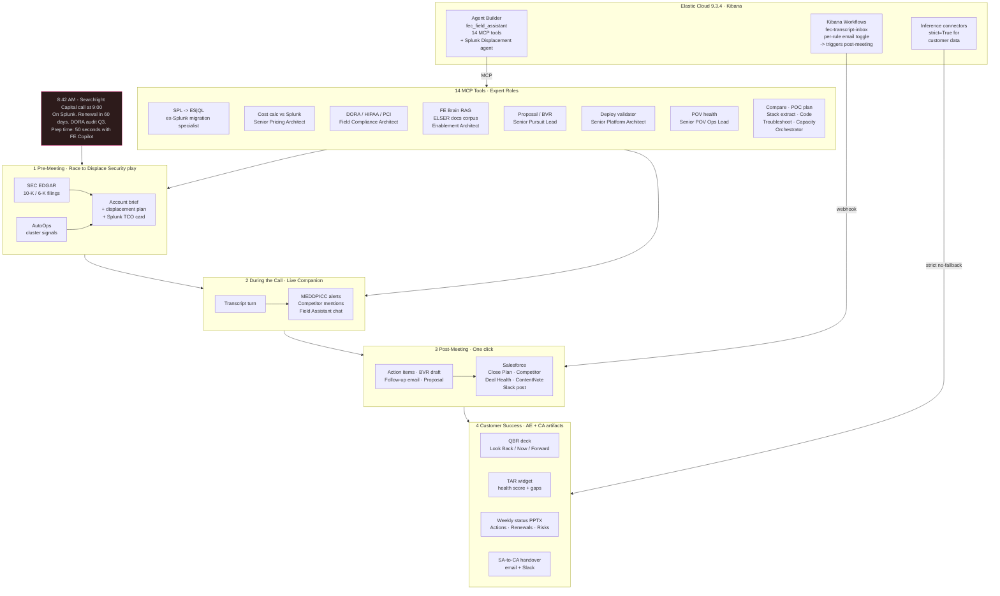
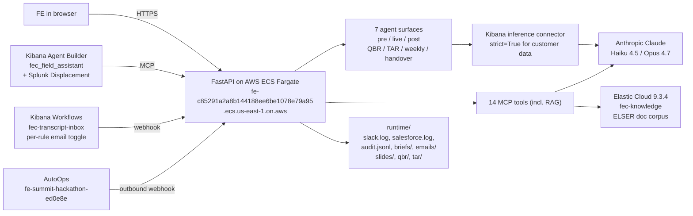

# How it works

```mermaid
flowchart TD
    classDef elastic fill:#005571,stroke:#00BFB3,color:#fff
    classDef claude fill:#0077CC,stroke:#1BA9F5,color:#fff
    classDef output fill:#1a1a2e,stroke:#00BFB3,color:#d4d9e0
    classDef problem fill:#2d1b1b,stroke:#F04E98,color:#d4d9e0
    classDef action fill:#1b2d1b,stroke:#2dbe60,color:#d4d9e0

    MORNING["8:42 AM - Searchlight Capital call at 9:00\nOn Splunk. Renewal in 60 days. DORA audit Q3.\nPrep time: 50 seconds with FE Copilot"]:::problem

    MORNING --> PRE

    subgraph PRE["1 Pre-Meeting  ·  Race to Displace Security play"]
        direction LR
        EDGAR["SEC EDGAR\n10-K / 6-K filings"]
        AUTOOPS["AutoOps\ncluster signals"]
        BRIEF_OUT["Account brief\n+ displacement plan\n+ Splunk TCO card"]
        EDGAR --> BRIEF_OUT
        AUTOOPS --> BRIEF_OUT
    end

    subgraph LIVE["2 During the Call  ·  Live Companion"]
        direction LR
        TX["Transcript turn"] --> ALERTS["MEDDPICC alerts\nCompetitor mentions\nField Assistant chat"]
    end

    subgraph POST["3 Post-Meeting  ·  One click"]
        direction LR
        POST_OUT["Action items · BVR draft\nFollow-up email · Proposal"]
        SFDC["Salesforce\nClose Plan · Competitor\nDeal Health · ContentNote\nSlack post"]
        POST_OUT --> SFDC
    end

    subgraph CS["4 Customer Success  ·  AE + CA artifacts"]
        direction LR
        QBR["QBR deck\nLook Back / Now / Forward"]
        TAR["TAR widget\nhealth score + gaps"]
        WEEK["Weekly status PPTX\nActions · Renewals · Risks"]
        HAND["SA-to-CA handover\nemail + Slack"]
    end

    PRE --> LIVE
    LIVE --> POST
    POST --> CS

    subgraph KIBANA["Elastic Cloud 9.3.4  ·  Kibana"]
        direction LR
        AB["Agent Builder\nfec_field_assistant\n14 MCP tools\n+ Splunk Displacement agent"]
        WF["Kibana Workflows\nfec-transcript-inbox\nper-rule email toggle\n-> triggers post-meeting"]
        INF["Inference connectors\nstrict=True for\ncustomer data"]
    end

    subgraph TOOLS["14 MCP Tools  ·  Expert Roles"]
        direction TB
        T1["SPL -> ES|QL\nex-Splunk migration specialist"]
        T2["Cost calc vs Splunk\nSenior Pricing Architect"]
        T3["DORA / HIPAA / PCI\nField Compliance Architect"]
        T4["FE Brain RAG\nELSER docs corpus\nEnablement Architect"]
        T5["Proposal / BVR\nSenior Pursuit Lead"]
        T6["Deploy validator\nSenior Platform Architect"]
        T7["POV health\nSenior POV Ops Lead"]
        T8["Compare · POC plan\nStack extract · Code\nTroubleshoot · Capacity\nOrchestrator"]
    end

    AB -->|MCP| TOOLS
    WF -->|webhook| POST
    INF -->|strict no-fallback| CS
    TOOLS --> PRE
    TOOLS --> LIVE
```

## Tech stack

```mermaid
flowchart LR
    User["FE in browser"] -->|HTTPS| API["FastAPI on AWS ECS Fargate<br/>fe-c85291a2a8b144188ee6be1078e79a95<br/>.ecs.us-east-1.on.aws"]
    API --> Agents["7 agent surfaces<br/>pre / live / post<br/>QBR / TAR / weekly / handover"]
    API --> Tools["14 MCP tools (incl. RAG)"]
    Agents --> Inf["Kibana inference connector<br/>strict=True for customer data"]
    Tools --> Anthropic["Anthropic Claude<br/>Haiku 4.5 / Opus 4.7"]
    Inf --> Anthropic
    Tools --> ES["Elastic Cloud 9.3.4<br/>fec-knowledge<br/>ELSER doc corpus"]
    Kibana["Kibana Agent Builder<br/>fec_field_assistant<br/>+ Splunk Displacement"] -->|MCP| API
    Wf["Kibana Workflows<br/>fec-transcript-inbox<br/>per-rule email toggle"] -->|webhook| API
    AutoOps["AutoOps<br/>fe-summit-hackathon-ed0e8e"] -->|outbound webhook| API
    API --> Runtime["runtime/<br/>slack.log, salesforce.log,<br/>audit.jsonl, briefs/, emails/<br/>slides/, qbr/, tar/"]
```

For deeper component descriptions and three hero data flows see [`architecture.md`](architecture.md).
